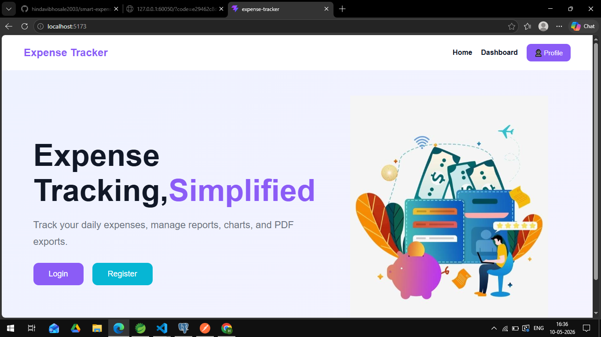
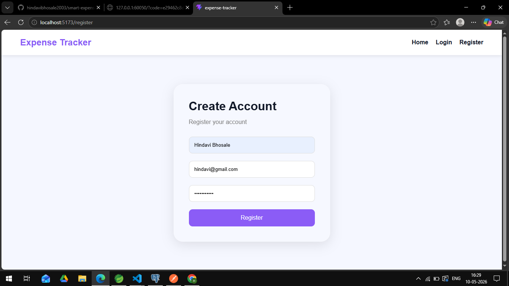
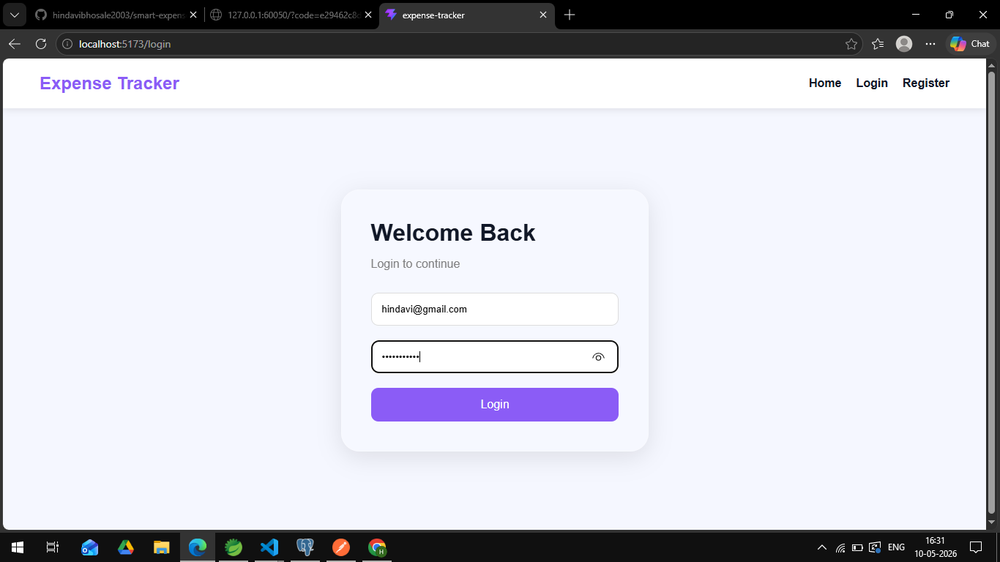
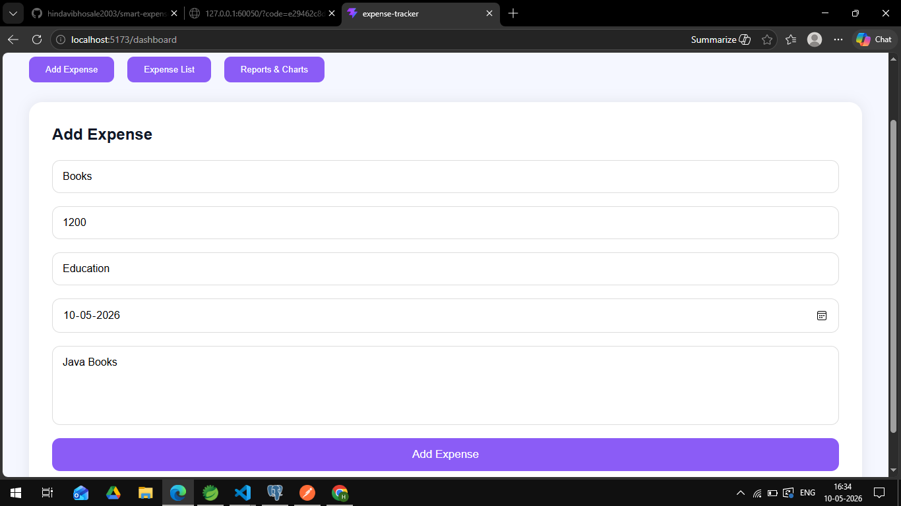
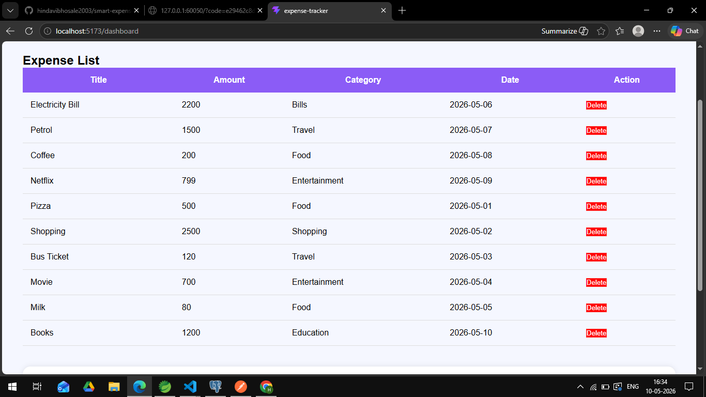
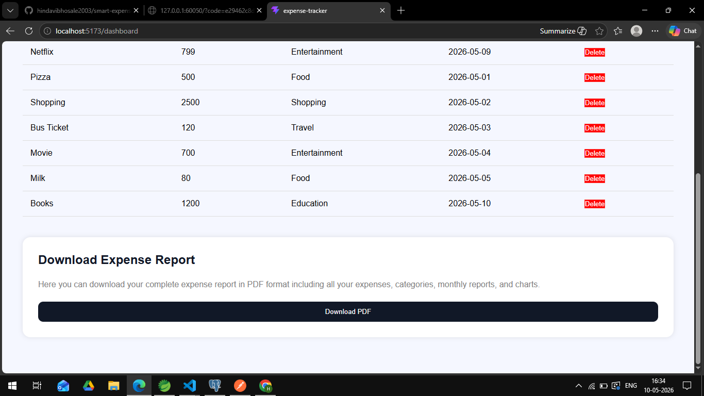
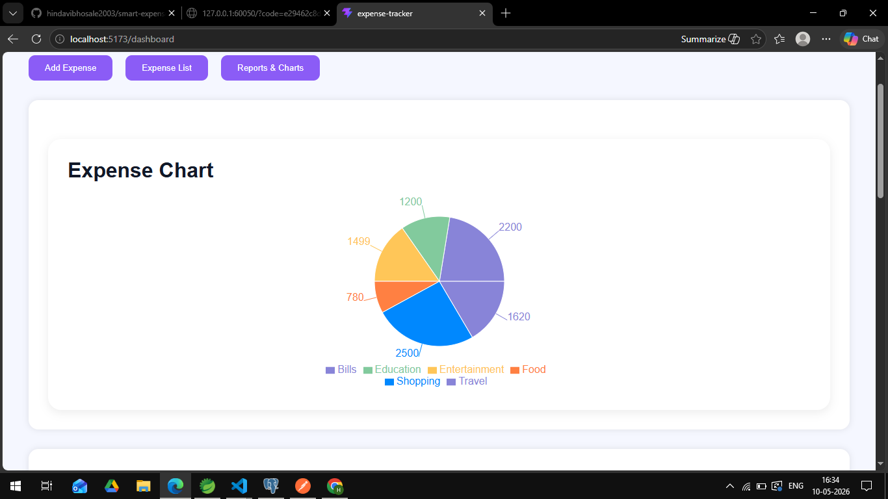
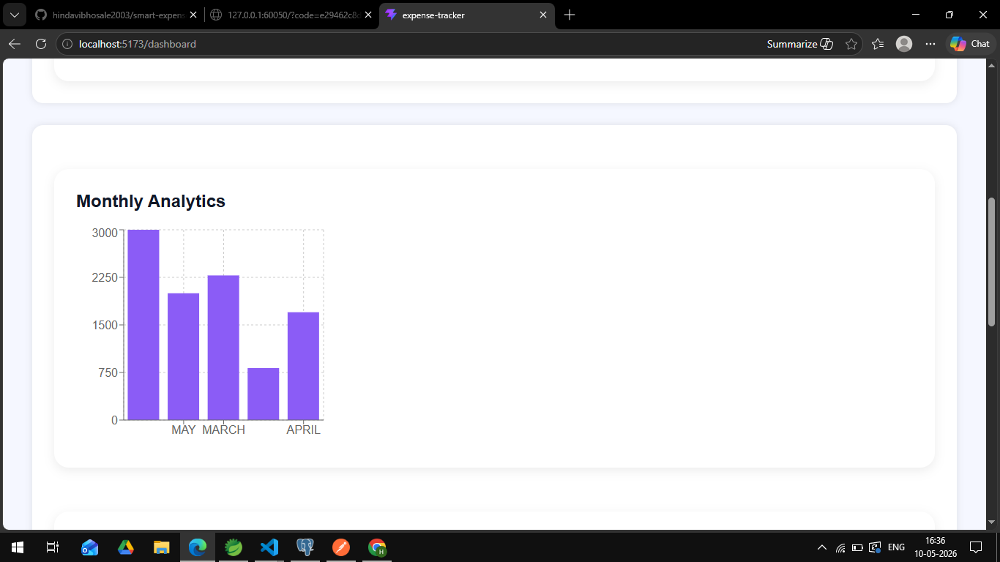
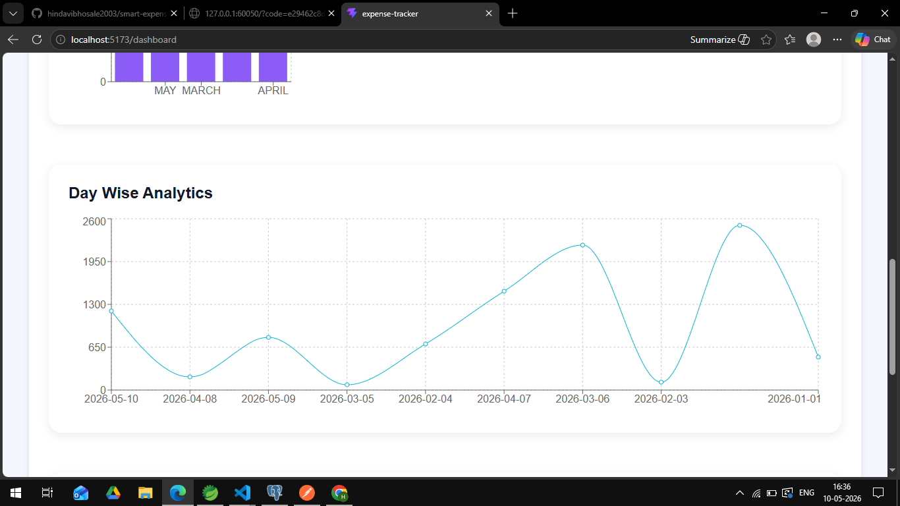
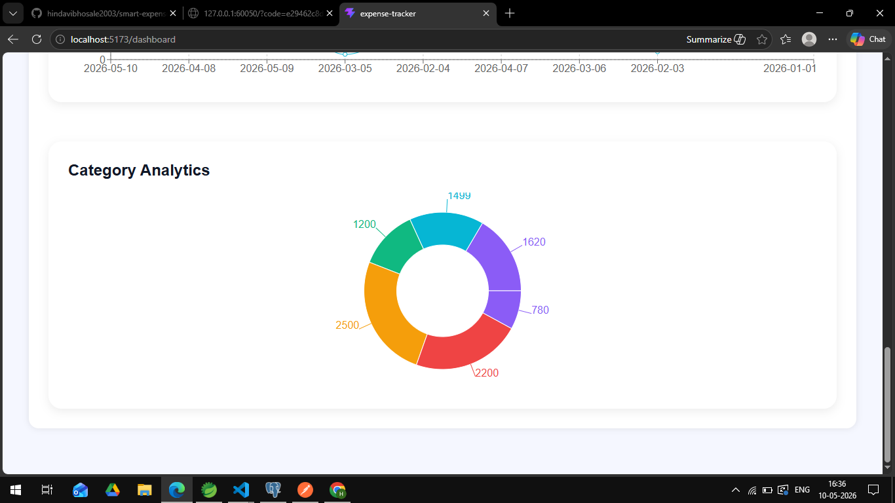

# Expense Tracker Full Stack Application

A Full Stack Expense Tracker Application.

## Backend
- Spring Boot
- Spring Security
- JWT Authentication
- MySQL
- REST APIs

## Frontend
- React JS
- Axios
- Recharts
- HTML
- CSS
- JavaScript

## Features
- User Registration & Login
- JWT Authentication
- Add Expense
- Expense List
- Delete Expense
- Monthly Reports
- Analytics Dashboard
- Pie / Bar / Line Charts
- PDF Report Download
- Global Exception Handling

## Technologies Used
- Java
- Spring Boot
- React JS
- MySQL
- HTML
- CSS
- JavaScript

## Project Structure

expense-tracker-fullstack
├── backend
├── frontend
├── screenshots
└── README.md

# Screenshots

## Home Page

## Register Page

## Login Page

## Add Expense

## Expense List

## Expense Download

## Expense Charts

## Monthly Analytics

## Day Wise Analytics

## Category Analytics

